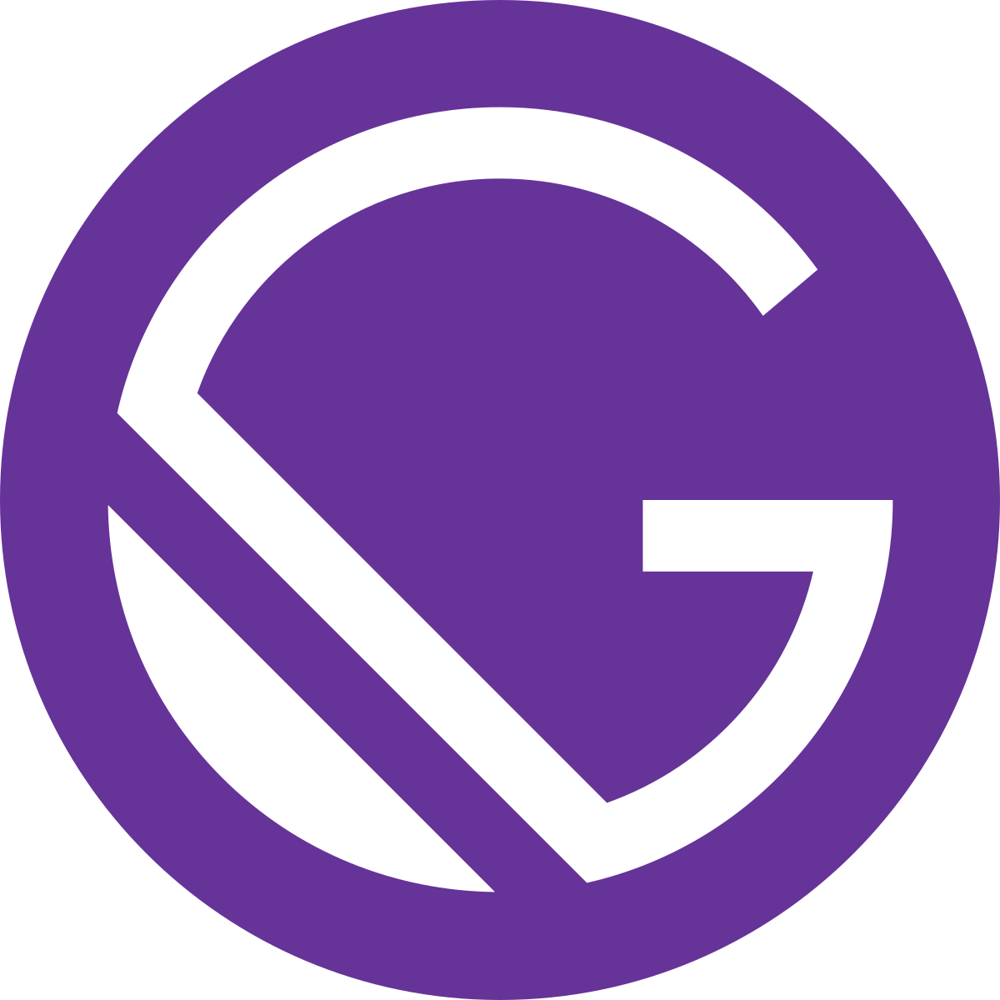

# Gatsby Starter

This is a boilerplate made by Pixelmatters to allow an easier start on gatsby projects.

<h2>What is Gatsby ?</h2>

  

Gatsby is a React-based, GraphQL powered, static site generator. Gatsby combines the best parts of React, webpack, react-router, GraphQL, and other front-end tools in to one very enjoyable developer experience.

Gatsby builds a website that uses only static files for incredibly fast page loads, service workers, code splitting, server-side rendering, intelligent image loading, asset optimization, and data prefetching. **All out of the box.**

If you need more information on [Gatsby](https://www.gatsbyjs.org/docs/).

<h2>What is GraphQL ?</h2>

  

GraphQL is a query language for your API, and a server-side runtime for executing queries by using a type system you define for your data. GraphQL isn't tied to any specific database or storage engine and is instead backed by your existing code and data.

If you need more information on [GraphQL](https://graphql.org/learn/).